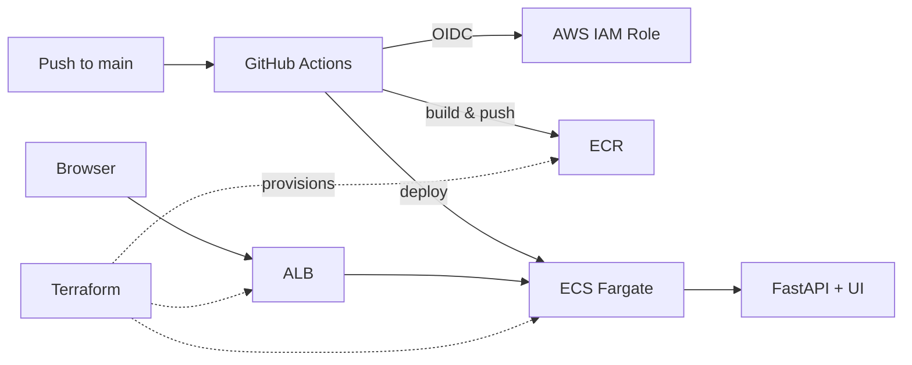
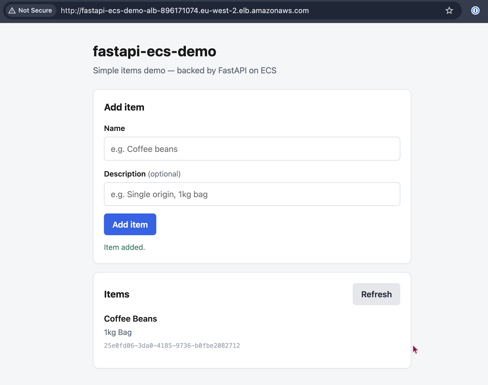
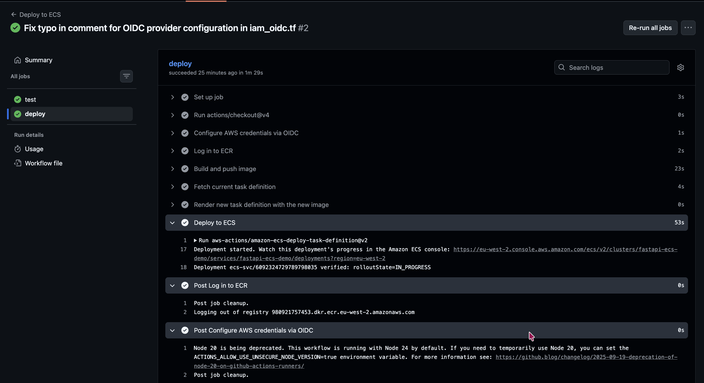
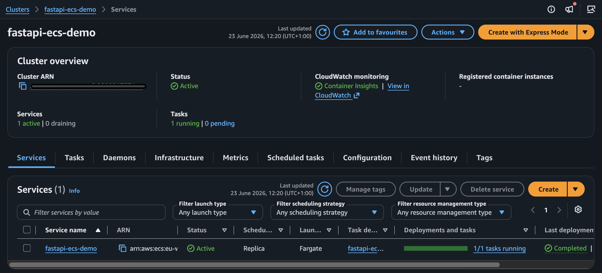
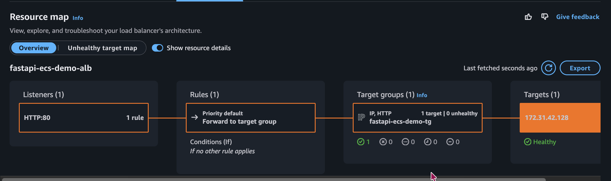

# fastapi-ecs-demo

An end-to-end reference for shipping a Python API to production on AWS — without the usual complexity.

**FastAPI** → **Docker** → **ECR** → **ECS Fargate** → **ALB**, provisioned with **Terraform**, deployed by **GitHub Actions** via **OIDC** (no long-lived AWS keys in CI).

---

## At a glance

| Layer | Choice |
|-------|--------|
| App | FastAPI + vanilla JS UI, deps via [uv](https://docs.astral.sh/uv/) |
| Container | Multi-stage Dockerfile, non-root runtime user |
| Registry | Amazon ECR (immutable tags, scan on push) |
| Compute | ECS on Fargate (0.25 vCPU / 512 MB) |
| Networking | Application Load Balancer → ECS service |
| IaC | Terraform (default VPC, public subnets — demo tradeoff) |
| CI/CD | GitHub Actions → OIDC → ECR push → ECS rolling deploy |



---

## Screenshots

### Live app (UI)



*The vanilla JS frontend calling the same `/items` JSON API running on Fargate.*

### CI/CD — green deploy



*Push to `main` → pytest → Docker build → ECR push (git SHA tag) → ECS rolling update.*

### AWS — ECS service running



*One Fargate task behind the target group; health checks hit `/health`.*

### Load balancer — healthy target



*The ALB forwards traffic to the ECS service on port 8000.*

### Architecture overview


*Full path from push to production.*

---

## Quick start

### Local development

```bash
uv sync --dev
uv run uvicorn app.main:app --reload
```

Open [http://localhost:8000](http://localhost:8000) for the UI, or [http://localhost:8000/docs](http://localhost:8000/docs) for the API explorer.

```bash
uv run pytest -q
```

### Docker

```bash
docker build -t fastapi-ecs-demo .
docker run -p 8000:8000 fastapi-ecs-demo
# or: docker compose up --build
```

---

## Deploy to AWS

### Prerequisites

- AWS CLI configured (`aws configure` or SSO) with permissions for ECR, ECS, IAM, ELB, and CloudWatch
- Terraform >= 1.7
- Copy `terraform/terraform.tfvars.example` → `terraform/terraform.tfvars` and set your GitHub org/repo (scopes the OIDC trust policy)

### Bootstrap order

ECR must exist before ECS can pull an image.

**1. Create the registry**

```bash
cd terraform
terraform init
terraform apply -target=aws_ecr_repository.app
```

**2. Push an initial image**

```bash
cd ..
aws ecr get-login-password --region eu-west-2 | \
  docker login --username AWS --password-stdin <account-id>.dkr.ecr.eu-west-2.amazonaws.com

docker build -t fastapi-ecs-demo .
docker tag fastapi-ecs-demo:latest <account-id>.dkr.ecr.eu-west-2.amazonaws.com/fastapi-ecs-demo:latest
docker push <account-id>.dkr.ecr.eu-west-2.amazonaws.com/fastapi-ecs-demo:latest
```

**3. Provision everything else**

```bash
cd terraform
terraform apply
```

Note `alb_dns_name` and `github_actions_role_arn` from the outputs.

**4. Wire up CI/CD**

In GitHub: **Settings → Secrets and variables → Actions → Variables**, add:

| Variable | Value |
|----------|-------|
| `AWS_GITHUB_ACTIONS_ROLE_ARN` | `terraform output -raw github_actions_role_arn` |

Push to `main`. The workflow tests, builds, pushes a SHA-tagged image, and deploys to ECS. Terraform ignores task definition changes after the first apply so CI owns deploys.

---

## API routes

| Route | Description |
|-------|-------------|
| `GET /` | Simple items UI (HTML) |
| `GET /health` | Health check (ALB + ECS) |
| `GET /items` | List items (JSON) |
| `POST /items` | Create item (JSON) |
| `GET /items/{id}` | Get item by ID |
| `GET /docs` | Swagger UI |

Items are stored in memory — fine for a demo; they reset when the task restarts.

---

## Cost note

Sized to stay cheap, not free. Roughly **£25–35/month** in `eu-west-2` if left running 24/7 (Fargate + ALB + public IPv4). Tear down when idle:

```bash
cd terraform
terraform destroy
```

ECR images persist after destroy unless you delete the repository separately.

---

## Production hardening (intentionally omitted)

This repo is a **clear demo**, not a production template:

- Private subnets + NAT Gateway or VPC endpoints (drop `assign_public_ip`)
- ACM certificate + HTTPS listener on the ALB
- Remote Terraform state (S3 + DynamoDB — stub in `providers.tf`)
- Narrow IAM on the **task** role for app AWS access (never the execution role)
- Fargate Spot for non-critical workloads (~70% compute savings)

See [`CLAUDE.md`](CLAUDE.md) for architecture notes useful when extending the project.

---

## License

MIT — use it as a starting point for your own experiments.
